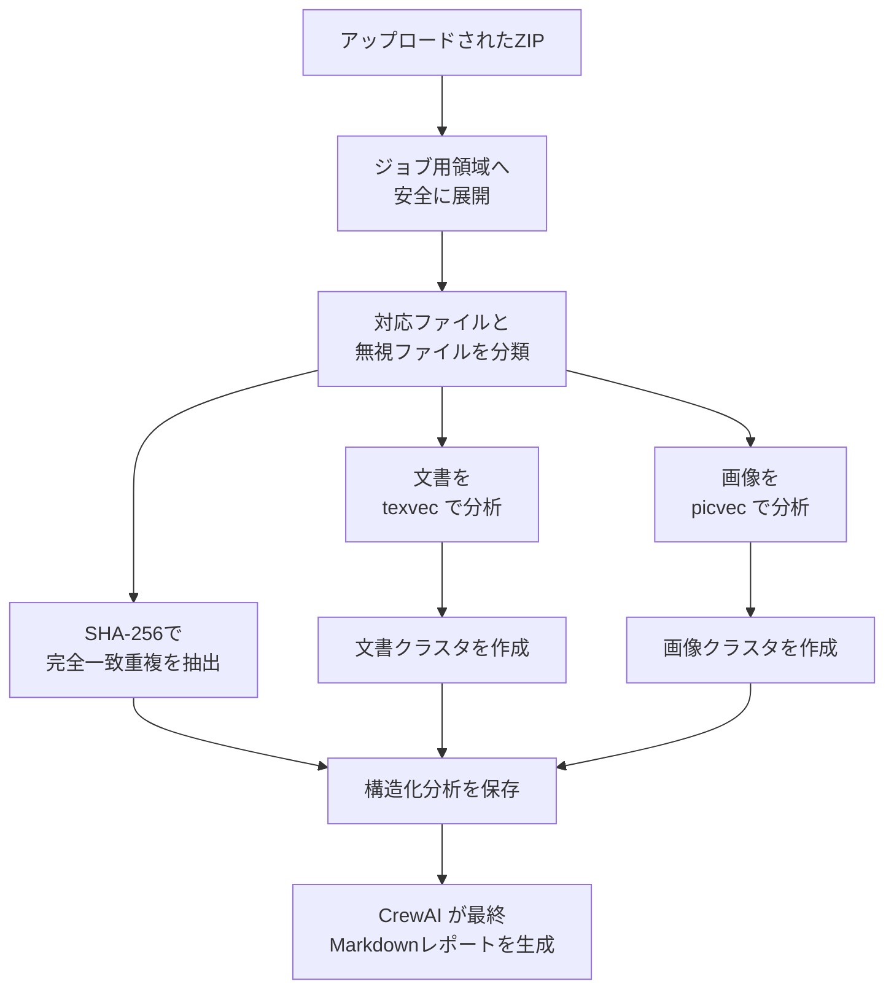

<p align="center">
  
</p>

<h1 align="center">omnivec</h1>

<p align="center">
  <strong>ローカルファーストの文書・画像類似分析を行う、APIファーストのアセットライブラリアン。</strong>
</p>

<p align="center">
  <a href="README.md">English</a> ·
  <a href="#インストール">インストール</a> ·
  <a href="#クイックスタート">クイックスタート</a> ·
  <a href="#コードガイド">コードガイド</a> ·
  <a href="#api">API</a> ·
  <a href="#docker">Docker</a> ·
  <a href="#開発">開発</a>
</p>

---

omnivecは、文書と画像をまとめたZIPを受け取り、`texvec` と `picvec` でローカル類似分析を行い、次の2つを返します。

- 構造化されたJSON分析結果
- その分析結果から作るMarkdownレポート

## 最初に押さえること

- 1回のアップロードごとに1つのジョブディレクトリを使います。
- ZIP展開、ファイル分類、重複判定、類似検索、クラスタリングは決定的に処理されます。
- CrewAIを使うのは最後のMarkdownレポート生成だけです。
- コードを追うときは、まず `api.py` を見て、次に `jobs.py` を読むのが最短です。

このコードベースをどう広げていけるかの案は [Extending Omnivec](docs/extending-omnivec.md) を参照してください。

## インストール

Python `>=3.10,<3.14` と [uv](https://docs.astral.sh/uv/) を用意してください。

Python依存をインストールします:

```sh
uv sync
```

Dockerなしでローカル実行する場合は、`texvec` と `picvec` が `PATH` 上に必要です。

ローカルソースからビルドする例:

```sh
cd ~/Documents/GitHub/picvec
go build -o /usr/local/bin/picvec .

cd ~/Documents/GitHub/texvec
go build -o /usr/local/bin/texvec .
```

必要な環境変数を設定します:

```sh
export OPENAI_API_KEY=your-key
export OMNIVEC_DATA_DIR=$PWD/.omnivec-data
export OMNIVEC_API_KEY=dev-secret
```

`OPENAI_API_KEY` は [OpenAI Platform の API keys ページ](https://platform.openai.com/settings/organization/api-keys) で作成できます。

必要なら、これらの値を `.env` に入れても構いません。同梱の `Makefile` は `.env` が存在すれば自動で読み込みます。

## クイックスタート

このリポジトリには `sample_assets/` に小さなデモ用コーパスが入っています。

ZIPを作成:

```sh
cd sample_assets
zip -r ../sample-assets.zip .
```

APIを起動:

```sh
uv run omnivec
```

ジョブを作成:

```sh
curl -X POST \
  -H "X-API-Key: dev-secret" \
  -F "file=@sample-assets.zip" \
  http://127.0.0.1:8000/v1/jobs
```

CrewAIレポートの方向づけをしたい場合は、任意で `curation_goal` を指定できます:
`discovery`、`dedupe`、`taxonomy_cleanup`。

状態確認:

```sh
curl -H "X-API-Key: dev-secret" \
  http://127.0.0.1:8000/v1/jobs/<job_id>
```

完了後のレポート取得:

```sh
curl -H "X-API-Key: dev-secret" \
  http://127.0.0.1:8000/v1/jobs/<job_id>/report
```

## コードガイド

最初にコードを読むなら、`src/omnivec/api.py` と `src/omnivec/jobs.py` から始めるのがおすすめです。この2つで、リクエスト受付からレポート保存までの流れが見えます。

| 知りたいこと | まず見る場所 | 次に見る場所 |
|-------------|--------------|--------------|
| リクエストがどこから入るか | `src/omnivec/api.py` | `src/omnivec/schemas.py` |
| ZIPアップロード後に何が起きるか | `src/omnivec/jobs.py` | `src/omnivec/storage.py` |
| ZIP展開とファイル分類の仕組み | `src/omnivec/ingestion.py` | `tests/test_ingestion.py` |
| `texvec` と `picvec` の呼び出し方 | `src/omnivec/runners.py` | `tests/test_runners.py` |
| 類似結果がどうクラスタになるか | `src/omnivec/clustering.py` | `tests/test_clustering.py` |
| 最終レポートがどう作られるか | `src/omnivec/reporting.py` | `src/omnivec/crew.py` |
| 実行時設定がどこで決まるか | `src/omnivec/settings.py` | `tests/test_settings.py` |
| APIレスポンスの項目定義 | `src/omnivec/schemas.py` | `tests/test_api.py` |

### 変更箇所の見つけ方

| 変更したい内容 | 先に編集する場所 | 確認先 |
|---------------|------------------|--------|
| アップロード処理、認証、HTTPレスポンス | `src/omnivec/api.py`, `src/omnivec/schemas.py` | `tests/test_api.py` |
| ジョブ状態遷移、エラー処理、TTLによる削除 | `src/omnivec/jobs.py`, `src/omnivec/storage.py` | `tests/test_jobs.py`, `tests/test_api.py` |
| 対応ファイル形式やZIP安全性 | `src/omnivec/ingestion.py` | `tests/test_ingestion.py` |
| runner初期化やCLI出力解析 | `src/omnivec/runners.py` | `tests/test_runners.py` |
| クラスタリングの挙動 | `src/omnivec/clustering.py` | `tests/test_clustering.py` |
| レポート内容やCrewAI連携 | `src/omnivec/reporting.py`, `src/omnivec/crew.py`, `src/omnivec/config/` | ローカルスモークテスト |
| 環境変数やデフォルトパス | `src/omnivec/settings.py`, `README.md`, `README.ja.md` | `tests/test_settings.py` |

## よく使うコマンド

整理されたコマンド群を使いたい場合は、同梱の `Makefile` を使えます。

```sh
make help
make sync
make format
make lint
make typecheck
make check
make test
make serve
make sample-zip
make smoke-all
```

おすすめの流れ:

1. `make sync`
2. `make check`
3. `make serve`
4. 別ターミナルで `make sample-zip`
5. その後 `make smoke-all`

`make serve` は起動前に共有 `texvec` / `picvec` キャッシュを初期化するようになったため、最初の起動時はランタイムやモデル準備で少し時間がかかることがあります。

`make create-job`、`make job-status`、`make job-report`、`make smoke-all` は、デフォルトで `.env` の `OMNIVEC_API_KEY` を使い、未設定時のみ `dev-secret` にフォールバックします。

`make create-job` と `make smoke-all` では、`CURATION_GOAL=discovery`、
`dedupe`、`taxonomy_cleanup` も指定できます。
どちらのコマンドも送信前にアップロード内容の要約を表示します。

特定ジョブを個別に確認したい場合:

```sh
make job-status JOB_ID=<job_id>
make job-report JOB_ID=<job_id>
```

## API

| エンドポイント | 内容 |
|---------------|------|
| `POST /v1/jobs` | ZIPをアップロードして新しい分析ジョブを作成 |
| `GET /v1/jobs/{job_id}` | ジョブ状態、件数、時刻、エラーを返す |
| `GET /v1/jobs/{job_id}/report` | Markdownレポートと構造化分析JSONを返す |
| `GET /healthz` | ヘルスチェック |

`OMNIVEC_API_KEY` が設定されている場合、`/v1/*` には `X-API-Key` が必要です。

`POST /v1/jobs` は次のmultipart formフィールドを受け付けます:

- ZIPアップロード用の `file`
- 任意の `curation_goal`。値は `discovery`、`dedupe`、`taxonomy_cleanup`

`curation_goal` を省略した場合、最終レポートはバランス重視になります。

### 対応入力

- 文書: `.txt`, `.md`, `.markdown`
- 画像: `.jpg`, `.jpeg`, `.png`

文書だけ、画像だけ、両方を含むZIPに対応しています。未対応ファイルは無視され、結果に一覧表示されます。

## 仕組み

次の図は、各ジョブで内部的に実行される処理の流れだけに絞っています。



構造化分析まではローカルかつ決定的に処理されます。CrewAI は、その保存済み分析結果を最終Markdownレポートへ整える役割だけを担います。

1. アップロードされたZIPをジョブ用ワークスペースへ展開します。
2. 対応ファイルと無視ファイルを分類します。
3. SHA-256で完全一致重複をまとめます。
4. 文書は `texvec`、画像は `picvec` で分析します。
5. 相互近傍の結果からクラスタを作ります。
6. 分析結果をディスクへ保存します。
7. 保存済み分析結果からMarkdownレポートを生成します。

## サンプルアセット

`sample_assets/` には次のものが入っています。

- ローカル `texvec` リポジトリ由来の文書サンプル
- ローカル `picvec` リポジトリ由来のJPEG画像サンプル
- 意図的に複製した文書1件
- 意図的に複製した画像1件

ローカルデモや手動スモークチェックに使えます。

## データ保存先

実行時データは `OMNIVEC_DATA_DIR` 配下に保存されます。

```text
OMNIVEC_DATA_DIR/
  jobs/
    <job_id>/
      upload.zip
      extracted/
      status.json
      analysis.json
      report.md
  cache/
    texvec/
    picvec-home/
```

共有キャッシュには重いランタイム資産やモデル資産を保存します。一方で各ジョブは個別のインデックス状態を持つため、別アップロードの結果が混ざりません。

## 設定

| 変数 | 内容 | デフォルト |
|------|------|------------|
| `OMNIVEC_DATA_DIR` | ジョブと共有キャッシュの保存先 | `.omnivec-data` |
| `OMNIVEC_API_KEY` | `/v1/*` 用の任意APIキー | 未設定 |
| `MODEL` | CrewAIで使うモデル文字列 | `openai/gpt-4o-mini` |
| `OMNIVEC_TEXVEC_BIN` | `texvec` バイナリパス | `texvec` |
| `OMNIVEC_PICVEC_BIN` | `picvec` バイナリパス | `picvec` |
| `OMNIVEC_MAX_CONCURRENT_JOBS` | 同時実行ジョブ数 | `1` |
| `OMNIVEC_MAX_NEIGHBORS` | クラスタリングに使う近傍数 | `3` |
| `OMNIVEC_JOB_TTL_HOURS` | 完了ジョブ成果物のTTL | `72` |
| `OPENAI_API_KEY` | CrewAIレポート生成に必要 | 未設定 |

## Docker

イメージをビルド:

```sh
docker build -t omnivec .
```

実行:

```sh
docker run --rm \
  -p 8000:8000 \
  -e OPENAI_API_KEY=your-key \
  -e OMNIVEC_API_KEY=prod-secret \
  -e OMNIVEC_DATA_DIR=/data \
  -v "$(pwd)/.omnivec-data:/data" \
  omnivec
```

Dockerfileでは:

- 固定リビジョンの `picvec` と `texvec` をGoステージでビルド
- 現在の `texvec` ピンは `v1.1.0`
- Python依存を `uv` でインストール
- Uvicornでomnivec APIを起動

## Railway

このリポジトリには `railway.toml` と Dockerfile ベースのデプロイ設定があります。

推奨構成:

1. `/data` にマウントする永続ボリュームを作成
2. `OMNIVEC_DATA_DIR=/data` を設定
3. `OPENAI_API_KEY` を設定
4. 必要なら `OMNIVEC_API_KEY` も設定

最初の実行時に、`texvec` と `picvec` は共有キャッシュへONNX Runtimeとデフォルトモデルをダウンロードします。

## 対応プラットフォーム

| デプロイ形態 | 主な対象 |
|-------------|----------|
| ローカル開発 | Pythonとローカルバイナリを使うmacOS / Linux |
| Docker | Linuxコンテナ |
| Railway | 永続ボリューム付きのDockerfileベースLinuxデプロイ |

## 開発

```sh
uv sync
uv run ruff format .
uv run ruff check .
uv run pyright
uv run pytest
uv run omnivec
```

デフォルトのテストスイートはオフラインで動き、fake runner と fake report generator を使うため、OpenAI認証情報やモデルダウンロード、ネットワークアクセスは不要です。

おすすめのローカルチェック:

- `uv run ruff format .` でPythonコードを整形します。
- `uv run ruff check .` でlintとimport順を確認します。
- `uv run pyright` で型チェックを行います。
- `uv run pytest` でオフラインのテストスイートを実行します。

コントリビュート手順は [CONTRIBUTING.md](CONTRIBUTING.md) を参照してください。AIエージェント向けのリポジトリ固有ルールは [AGENTS.md](AGENTS.md) にあります。

## ライセンス

omnivec は [MIT License](LICENSE) で公開しています。

---

<p align="center">
  <a href="https://arcnem.ai">Arcnem AI</a> が開発。
</p>
