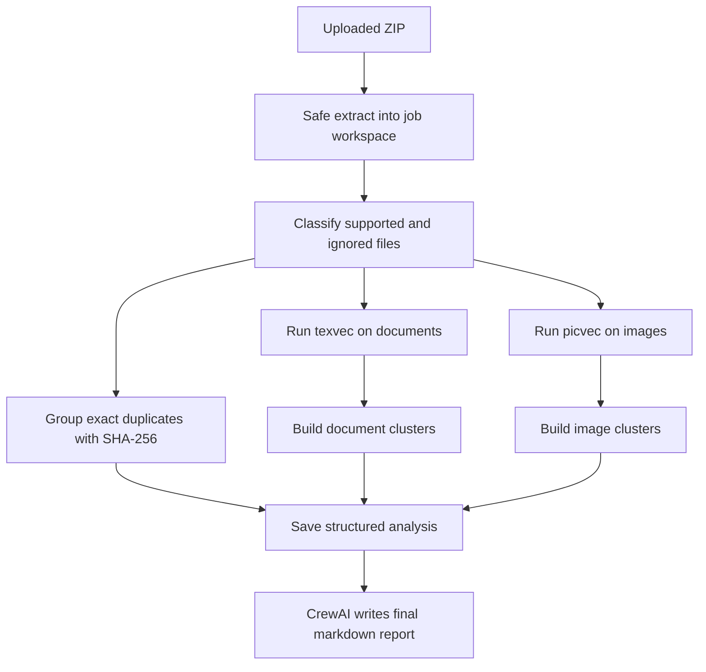

<p align="center">
  
</p>

<h1 align="center">omnivec</h1>

<p align="center">
  <strong>API-first asset librarian for local-first document and image similarity analysis.</strong>
</p>

<p align="center">
  <a href="README.ja.md">日本語</a> ·
  <a href="#install">Install</a> ·
  <a href="#quick-start">Quick Start</a> ·
  <a href="#code-tour">Code Tour</a> ·
  <a href="#api">API</a> ·
  <a href="#docker">Docker</a> ·
  <a href="#development">Development</a>
</p>

---

omnivec accepts a ZIP of documents and images, runs local similarity analysis with `texvec` and `picvec`, and returns:

- structured JSON analysis
- a markdown report written from that analysis

## What To Know First

- One upload creates one job directory on disk.
- ZIP extraction, file classification, duplicate detection, similarity search, and clustering are deterministic.
- CrewAI is only used for the final markdown report.
- The fastest way to understand the code is `api.py` -> `jobs.py` -> the helper module for the part you want to change.

## Install

Ensure you have Python `>=3.10,<3.14` and [uv](https://docs.astral.sh/uv/) installed.

Install Python dependencies:

```sh
uv sync
```

If you want to run omnivec locally without Docker, make sure `texvec` and `picvec` are available on your `PATH`.

For example, from local source checkouts:

```sh
cd ~/Documents/GitHub/picvec
go build -o /usr/local/bin/picvec .

cd ~/Documents/GitHub/texvec
go build -o /usr/local/bin/texvec .
```

Set the required environment variables:

```sh
export OPENAI_API_KEY=your-key
export OMNIVEC_DATA_DIR=$PWD/.omnivec-data
export OMNIVEC_API_KEY=dev-secret
```

If you prefer, put those values in `.env`. The included `Makefile` automatically loads `.env` when it exists.

## Quick Start

The repo includes a small demo corpus under `sample_assets/`.

Create a ZIP:

```sh
cd sample_assets
zip -r ../sample-assets.zip .
```

Start the API:

```sh
uv run omnivec
```

Create a job:

```sh
curl -X POST \
  -H "X-API-Key: dev-secret" \
  -F "file=@sample-assets.zip" \
  http://127.0.0.1:8000/v1/jobs
```

Check status:

```sh
curl -H "X-API-Key: dev-secret" \
  http://127.0.0.1:8000/v1/jobs/<job_id>
```

Fetch the completed report:

```sh
curl -H "X-API-Key: dev-secret" \
  http://127.0.0.1:8000/v1/jobs/<job_id>/report
```

## Code Tour

If you are reading the code for the first time, start with `src/omnivec/api.py` and `src/omnivec/jobs.py`. Those two files show the full request path before the work splits into helpers.

| If you want to understand... | Start here | Then check |
|------------------------------|------------|------------|
| how a request enters the app | `src/omnivec/api.py` | `src/omnivec/schemas.py` |
| what happens after a ZIP upload | `src/omnivec/jobs.py` | `src/omnivec/storage.py` |
| how ZIPs are unpacked and files are classified | `src/omnivec/ingestion.py` | `tests/test_ingestion.py` |
| how `texvec` and `picvec` are called | `src/omnivec/runners.py` | `tests/test_runners.py` |
| how similarity hits become clusters | `src/omnivec/clustering.py` | `tests/test_clustering.py` |
| how the final report is generated | `src/omnivec/reporting.py` | `src/omnivec/crew.py` |
| which settings shape runtime behavior | `src/omnivec/settings.py` | `tests/test_settings.py` |
| which response fields are part of the API | `src/omnivec/schemas.py` | `tests/test_api.py` |

### Common Change Paths

| To change... | Edit these files first | Check here |
|--------------|------------------------|------------|
| upload flow, auth, or HTTP response shape | `src/omnivec/api.py`, `src/omnivec/schemas.py` | `tests/test_api.py` |
| job lifecycle, error handling, or cleanup | `src/omnivec/jobs.py`, `src/omnivec/storage.py` | `tests/test_jobs.py`, `tests/test_api.py` |
| supported file types or ZIP safety rules | `src/omnivec/ingestion.py` | `tests/test_ingestion.py` |
| runner setup or CLI parsing | `src/omnivec/runners.py` | `tests/test_runners.py` |
| clustering behavior | `src/omnivec/clustering.py` | `tests/test_clustering.py` |
| report content or CrewAI wiring | `src/omnivec/reporting.py`, `src/omnivec/crew.py`, `src/omnivec/config/` | local smoke test |
| environment variables or default paths | `src/omnivec/settings.py`, `README.md`, `README.ja.md` | `tests/test_settings.py` |

## Common Commands

If you prefer a clean command surface, use the included `Makefile`:

```sh
make help
make sync
make format
make lint
make typecheck
make check
make test
make serve
make sample-zip
make smoke-all
```

Useful workflow:

1. `make sync`
2. `make check`
3. `make serve`
4. In another terminal, `make sample-zip`
5. Then `make smoke-all`

`make serve` now runs the shared `texvec` and `picvec` cache initialization first, so the first startup can take longer while runtimes and models are prepared.

`make create-job`, `make job-status`, `make job-report`, and `make smoke-all` use `OMNIVEC_API_KEY` from `.env` by default, and fall back to `dev-secret` only when it is unset.

You can also inspect a specific job manually:

```sh
make job-status JOB_ID=<job_id>
make job-report JOB_ID=<job_id>
```

## API

| Endpoint | What it does |
|---------|--------------|
| `POST /v1/jobs` | Upload a ZIP and enqueue a new analysis job |
| `GET /v1/jobs/{job_id}` | Return current job status, timestamps, counts, and any error |
| `GET /v1/jobs/{job_id}/report` | Return the final markdown report plus structured JSON analysis |
| `GET /healthz` | Liveness check |

If `OMNIVEC_API_KEY` is set, all `/v1/*` endpoints require `X-API-Key`.

### Supported Inputs

- Documents: `.txt`, `.md`, `.markdown`
- Images: `.jpg`, `.jpeg`, `.png`

ZIPs may contain documents only, images only, or both. Unsupported files are ignored and reported back.

## How It Works

The diagram below focuses on the internal pipeline that runs for each job:



Everything up to the structured analysis stays local and deterministic. CrewAI only turns that saved analysis into the final markdown report.

1. Extract the uploaded ZIP into a job workspace.
2. Split files into supported and ignored groups.
3. Group exact duplicates with SHA-256.
4. Run `texvec` for documents and `picvec` for images.
5. Turn reciprocal nearest-neighbor hits into clusters.
6. Save the analysis to disk.
7. Generate the markdown report from the saved analysis.

## Sample Assets

`sample_assets/` includes:

- real text fixtures copied from the local `texvec` repo,
- real JPEG fixtures copied from the local `picvec` repo,
- one intentional duplicate document copy,
- one intentional duplicate image copy.

These files are useful for local demos and manual smoke checks.

## Data Storage

All runtime data lives under `OMNIVEC_DATA_DIR`:

```text
OMNIVEC_DATA_DIR/
  jobs/
    <job_id>/
      upload.zip
      extracted/
      status.json
      analysis.json
      report.md
  cache/
    texvec/
    picvec-home/
```

The shared cache stores the expensive runtime and model assets. Each job keeps separate indexing state so uploads do not leak into each other.

## Configuration

| Variable | Description | Default |
|----------|-------------|---------|
| `OMNIVEC_DATA_DIR` | Base directory for jobs and shared caches | `.omnivec-data` |
| `OMNIVEC_API_KEY` | Optional API key for `/v1/*` endpoints | unset |
| `MODEL` | CrewAI model string | `openai/gpt-4o-mini` |
| `OMNIVEC_TEXVEC_BIN` | `texvec` binary path | `texvec` |
| `OMNIVEC_PICVEC_BIN` | `picvec` binary path | `picvec` |
| `OMNIVEC_MAX_CONCURRENT_JOBS` | Number of jobs to run at once | `1` |
| `OMNIVEC_MAX_NEIGHBORS` | Reciprocal neighbor count for clustering | `3` |
| `OMNIVEC_JOB_TTL_HOURS` | TTL for finished job artifacts | `72` |
| `OPENAI_API_KEY` | Required for CrewAI report generation | unset |

## Docker

Build the image:

```sh
docker build -t omnivec .
```

Run it:

```sh
docker run --rm \
  -p 8000:8000 \
  -e OPENAI_API_KEY=your-key \
  -e OMNIVEC_API_KEY=prod-secret \
  -e OMNIVEC_DATA_DIR=/data \
  -v "$(pwd)/.omnivec-data:/data" \
  omnivec
```

The Dockerfile:

- builds pinned `picvec` and `texvec` binaries in a Go stage,
- currently pins `texvec` to `v1.1.0`,
- installs Python dependencies with `uv`,
- runs omnivec with Uvicorn.

## Railway

This repo includes `railway.toml` and a Dockerfile-based deployment path.

Recommended Railway setup:

1. Create a persistent volume mounted at `/data`.
2. Set `OMNIVEC_DATA_DIR=/data`.
3. Set `OPENAI_API_KEY`.
4. Optionally set `OMNIVEC_API_KEY`.

On first real run, `texvec` and `picvec` will download ONNX Runtime and their default models into the shared cache under the mounted volume.

## Platforms

| Deployment Mode | Primary Target |
|-----------------|----------------|
| Local dev | macOS or Linux with Python and local binaries |
| Docker | Linux containers |
| Railway | Dockerfile-based Linux deployment with persistent volume |

## Development

```sh
uv sync
uv run ruff format .
uv run ruff check .
uv run pyright
uv run pytest
uv run omnivec
```

The default test suite is offline and uses fake runners plus a fake report generator, so it does not require OpenAI credentials, model downloads, or network access.

Recommended local checks:

- `uv run ruff format .` formats Python code.
- `uv run ruff check .` runs lint checks and import sorting rules.
- `uv run pyright` runs type checks.
- `uv run pytest` runs the offline test suite.

See [CONTRIBUTING.md](CONTRIBUTING.md) for contribution workflow and [AGENTS.md](AGENTS.md) for repo-specific agent instructions.

## License

omnivec is released under the [MIT License](LICENSE).

---

<p align="center">
  Built by <a href="https://arcnem.ai">Arcnem AI</a>.
</p>
