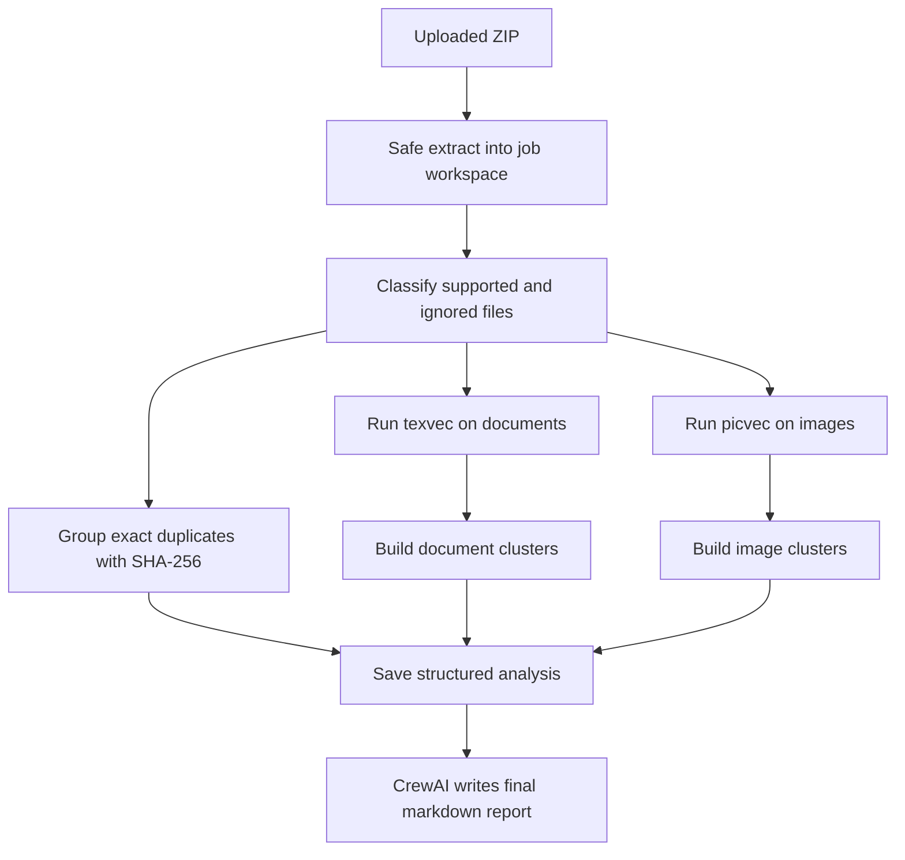

# Technical Overview

If you are reading the code for the first time, start with `src/omnivec/api.py` and `src/omnivec/jobs.py`.

Those two files show the full request path before the work splits into helpers.

## Job Pipeline

Everything up to the structured analysis stays local and deterministic. CrewAI only turns that saved analysis into the final markdown report.

1. Extract the uploaded ZIP into a job workspace.
2. Split files into supported and ignored groups.
3. Group exact duplicates with SHA-256.
4. Run `texvec` for documents and `picvec` for images.
5. Turn reciprocal nearest-neighbor hits into clusters.
6. Save the analysis to disk.
7. Generate the markdown report from the saved analysis.

## Supported Inputs

- Documents: `.txt`, `.md`, `.markdown`
- Images: `.jpg`, `.jpeg`, `.png`

ZIPs may contain documents only, images only, or both. Unsupported files are ignored and reported back.

## Code Tour

| If you want to understand... | Start here | Then check |
|------------------------------|------------|------------|
| how a request enters the app | `src/omnivec/api.py` | `src/omnivec/schemas.py` |
| what happens after a ZIP upload | `src/omnivec/jobs.py` | `src/omnivec/storage.py` |
| how ZIPs are unpacked and files are classified | `src/omnivec/ingestion.py` | `tests/test_ingestion.py` |
| how `texvec` and `picvec` are called | `src/omnivec/runners.py` | `tests/test_runners.py` |
| how similarity hits become clusters | `src/omnivec/clustering.py` | `tests/test_clustering.py` |
| how the final report is generated | `src/omnivec/reporting.py` | `src/omnivec/crew.py` |
| which settings shape runtime behavior | `src/omnivec/settings.py` | `tests/test_settings.py` |
| which response fields are part of the API | `src/omnivec/schemas.py` | `tests/test_api.py` |

## Common Change Paths

| To change... | Edit these files first | Check here |
|--------------|------------------------|------------|
| upload flow, auth, or HTTP response shape | `src/omnivec/api.py`, `src/omnivec/schemas.py` | `tests/test_api.py` |
| job lifecycle, error handling, or cleanup | `src/omnivec/jobs.py`, `src/omnivec/storage.py` | `tests/test_jobs.py`, `tests/test_api.py` |
| supported file types or ZIP safety rules | `src/omnivec/ingestion.py` | `tests/test_ingestion.py` |
| runner setup or CLI parsing | `src/omnivec/runners.py` | `tests/test_runners.py` |
| clustering behavior | `src/omnivec/clustering.py` | `tests/test_clustering.py` |
| report content or CrewAI wiring | `src/omnivec/reporting.py`, `src/omnivec/crew.py`, `src/omnivec/config/` | local smoke test |
| environment variables or default paths | `src/omnivec/settings.py`, `README.md`, `README.ja.md` | `tests/test_settings.py` |
